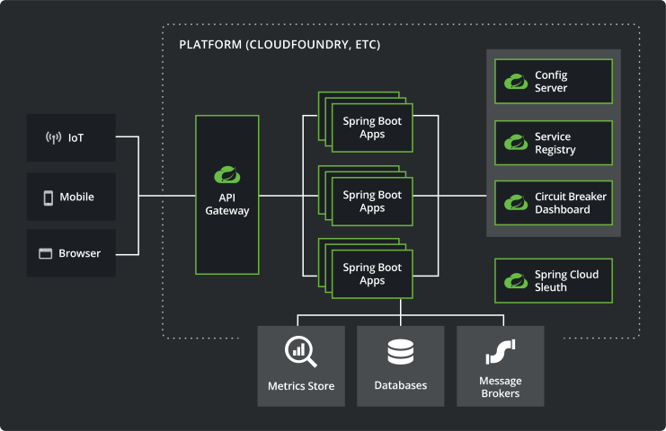

# Master Microservices with Spring Boot and Spring Cloud : PART 2 - Microservices with Spring Cloud

## Context

* Learning : <https://www.udemy.com/course/microservices-with-spring-boot-and-spring-cloud/learn/lecture/8005704#overview>
* Resources : [GitHub](https://github.com/in28minutes/spring-microservices/tree/master/03.microservices) et [FAQ](https://github.com/in28minutes/in28minutes-initiatives/blob/master/The-in28Minutes-TroubleshootingGuide-And-FAQ/quick-start.md)

## Content

* Establishing Communication between Microservices
* Centralized Microservice Configuration with Spring Cloud Config Server
* Using Spring Cloud Bus to exchange messages about Configuration updates
* Simplify communication with other Microservices using Feign REST Client
* Implement client side load balancing with Ribbon
* Implement dynamic scaling using Eureka Naming Server and Ribbon
* Implement API Gateway with Zuul
* Implement Distributed tracing with Spring Cloud Sleuth and Zipkin
* Implement Fault Tolerance with Zipkin

## Keywords 
* **Spring Cloud Config Server** : `spring-cloud-config-server` (config-server) as a dependency, annotation `@EnableConfigServer` in main class, `spring.cloud.config.server.git.uri` in configuration file application.properties
* **Any service** : `spring-cloud-starter-config` (config-client) as a dependency, `spring.application.name` and `spring.cloud.config.uri` in configuration file renamed as bootstrap.properties. see `http://{configServerLocation}/{serviceName}/{default|dev|qa...}` to display the retrieved/current configuration of a service.
* **Git Repository** : contains configuration files for each service/env : {spring.application.name}[dev|qa|blabla].properties
* **OpenFeign** : Is a declarative REST Client: Feign creates a dynamic implementation of an interface decorated with JAX-RS or Spring MVC annotations (see `@FeignClient`)
* **Ribbon** : allows client-side loadbalancing (see `spring-cloud-starter-netflix-ribbon`, `@RibbonClient` and `{serviceName}.ribbon.listOfServers`). [Somes details](https://github.com/Netflix/ribbon/wiki/Working-with-load-balancers#common-rules) about rules available.
* **Eureka** : service registry, useful because it makes client-side load-balancing easier and decouples service providers from consumers without the need for DNS.
  * Server : `spring-cloud-starter-netflix-eureka-server`, `@EnableEurekaServer`, `eureka.client.register-with-eureka`, `eureka.client.fetch-registry`, [Eureka UI](http://localhost:8761/)
  * Client : `spring-cloud-starter-netflix-eureka-client`, `@EnableDiscoveryClient`, `eureka.client.service-url.default-zone`
* **Zuul** : Api Gateway, all calls get routed through the API gateway, with common fetures like authentication, authorization and security, rate limits, fault tolerance, service aggregation; it's a great place for debugging, analytics...
  * Create a component for the Zuul API Gateway server. `spring-cloud-starter-netflix-zuul`, `@EnableZuulProxy`
  * Decide/implement what should it do when it intercepts a request. `ZuulFilter`
  * Make sure all important requests are configured to pass through the Zuul API Gateway. `@FeignClient(name = {api-gateway-app-name})`, `http://{zullGatewayLocation}/{serviceName}/{uri}` example <http://localhost:8765/currency-conversion-service/currency-converter-feign/from/EUR/to/INR/quantity/80> or <http://localhost:8765/currency-exchange-service/currency-exchange/from/EUR/to/INR>
* **Sleuth** : Distributed tracing, look for the trace ID in log message. Spring Cloud Sleuth is a layer over a Tracer library named Brave. `spring-cloud-starter-sleuth`, `brave.sampler.Sampler`
* **Message Broker** : Use of message broker to let the distributed tracing server consumes the messages/logs produced by the apps/services.
    * Here we used [**Rabbit MQ**](https://www.rabbitmq.com/)
    * Kafka is another well-known message broker
* **Zipkin** : Distributed Tracing **System**. Zipkin in listening to our Rabbit MQ server. trace data consumed by Zipkin are validated, stored, indexed for lookups. Zipkin provides API and UI for retrieving&viewing traces. [Latest release](https://search.maven.org/remote_content?g=io.zipkin&a=zipkin-server&v=LATEST&c=exec)
    * Start Zipkin server with 2 commands and [see UI](http://localhost:9411): 1) `set RABBIT_URI=amqp://localhost`  2) `java -jar zipkin-server-2.7.0-exec.jar`
    * Dependencies to add to our services :  `spring-cloud-starter-zipkin` (to trace message in a correct ziplin format), `org.springframework.amqp.spring-rabbit` (to put a trace message into Rabbit MQ)

## Best pratices
* **Dependencies**
    * Every service should add Config-Client `spring-cloud-starter-config` as a dependency to be able to connect to the Spring-Cloud config server.
    * While the Config server has `spring-cloud-config-server`
* **Naming** : Give a name to your applications `spring.application.name` to easily identify it
* **Configuration** : prefix your properties with the application name to easily identify them
    * Retrieve them with a class annotated with `@ConfigurationProperties`
 
## Spring Cloud Netflix Maintenance Mode

Some dependencies used in this project are in maintenance mode:

* Ribbon
* Zuul

The decision to move most of the Spring Cloud Netflix projects to maintenance mode was
a response to Netflix not continuing maintenance of many of the libraries that Spring provided
support for.

See [this blog entry](https://spring.io/blog/2018/12/12/spring-cloud-greenwich-rc1-available-now#spring-cloud-netflix-projects-entering-maintenance-mode)
for more information on maintenance mode and a list of suggested replacements for those libraries.

## Debugging Problems
* [Activate Spring Boot profile from IntelliJ](https://stackoverflow.com/a/52487280)
* [Share IntelliJ RUN configurations](https://www.jetbrains.com/help/idea/sharing-run-debug-configurations.html#)
* [Spring Cloud Config Server](https://github.com/in28minutes/in28minutes-initiatives/tree/master/The-in28Minutes-TroubleshootingGuide-And-FAQ#debugging-problems-with-spring-cloud-config-server)
* [Feign and Ribbon](https://github.com/in28minutes/in28minutes-initiatives/tree/master/The-in28Minutes-TroubleshootingGuide-And-FAQ#debugging-problems-with-feign-and-ribbon)
* [Naming Server Eureka and Ribbon](https://github.com/in28minutes/in28minutes-initiatives/tree/master/The-in28Minutes-TroubleshootingGuide-And-FAQ#debugging-problems-with-naming-server-eureka-and-ribbon)
* [Zuul API Gateway](https://github.com/in28minutes/in28minutes-initiatives/tree/master/The-in28Minutes-TroubleshootingGuide-And-FAQ#debugging-problems-with-zuul-api-gateway)
* [Zipkin](https://github.com/in28minutes/in28minutes-initiatives/tree/master/The-in28Minutes-TroubleshootingGuide-And-FAQ#debugging-problems-with-zipkin)

## Startup

### Reference Documentation
For further reference, please consider the following sections:
* [Spring Cloud Config](https://cloud.spring.io/spring-cloud-config/reference/html/)
* [Bootstrap Application Context](https://cloud.spring.io/spring-cloud-commons/multi/multi__spring_cloud_context_application_context_services.html#_the_bootstrap_application_context)
* [Spring Cloud OpenFeign : Declarative REST Client](https://cloud.spring.io/spring-cloud-netflix/multi/multi_spring-cloud-feign.html)
* [Spring Cloud Ribbon : Client-side load-balancing](https://cloud.spring.io/spring-cloud-netflix/multi/multi_spring-cloud-ribbon.html)
* [Spring Cloud Eureka : Service Registration and Discovery](https://cloud.spring.io/spring-cloud-netflix/reference/html/#spring-cloud-eureka-server)
* [Spring Cloud Zuul API Gateway : Intelligent Routing and Filtering](https://cloud.spring.io/spring-cloud-netflix/multi/multi__router_and_filter_zuul.html)
* [Spring Cloud Sleuth : Distributed Tracing](https://cloud.spring.io/spring-cloud-sleuth/reference/html/)
* [Rabbit MQ : Message Broker](http://next.rabbitmq.com/documentation.html)
* [Zipkin : Distributed Tracing System](https://github.com/openzipkin/zipkin)

### Guides
The following guides illustrate how to use some features concretely:

* [Centralized Configuration](https://spring.io/guides/gs/centralized-configuration/)
* [Spring Cloud OpenFeign : Declarative REST Client](https://spring.io/projects/spring-cloud-openfeign)
* [Spring Cloud Ribbon : Client-side load-balancing](https://spring.io/guides/gs/client-side-load-balancing/)
* [Spring Cloud Eureka : Service Registration and Discovery](https://spring.io/guides/gs/service-registration-and-discovery/)
* [Spring Cloud Zuul API Gateway : Intelligent Routing and Filtering](https://spring.io/guides/gs/routing-and-filtering/)
* [Spring Cloud Sleuth : Distributed Tracing](https://spring.io/projects/spring-cloud-sleuth#overview)
* [Rabbit MQ : Tutorials](https://www.rabbitmq.com/getstarted.html)
* [Zipkin : Distributed Tracing System](https://github.com/openzipkin/sleuth-webmvc-example#going-further).

### Architecture
See [Microservices with Spring Cloud](https://spring.io/microservices)

